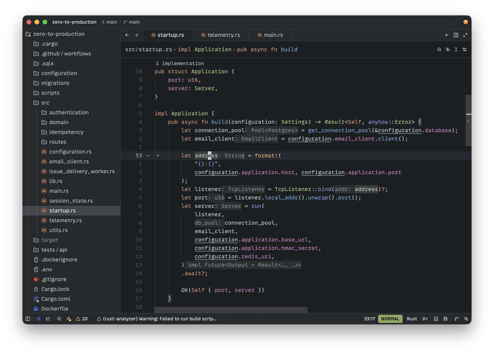
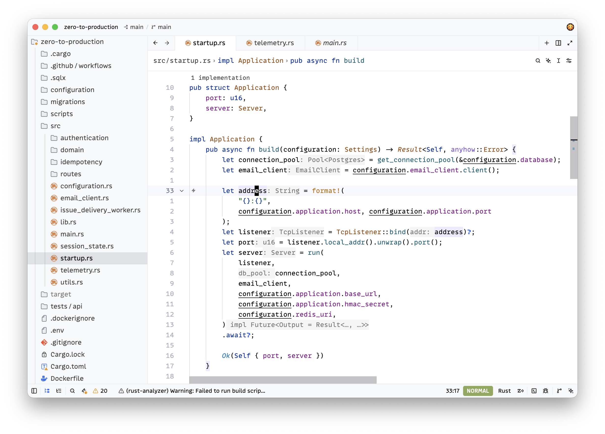

# JetBrains Themes for Zed Editor

A color theme extension for the [Zed editor](https://zed.dev/) based on JetBrains IDE color schemes. This theme brings the familiar and comfortable look of JetBrains IDEs (IntelliJ IDEA, PyCharm, WebStorm, RustRover, etc.) to your Zed editor experience.

## Theme Previews

### JetBrains Dark



### JetBrains Light



## Features

- Includes both **light** and **dark** theme variants
- Carefully crafted color palette based on JetBrains IDE themes
- Optimized for code readability and extended coding sessions
- Syntax highlighting that follows JetBrains color conventions

## Installation

To install the theme in Zed editor, open the [extension page](https://zed.dev/extensions/jetbrains-themes) and click **Install in Zed**.

Alternatively, you can install it from within the Zed editor:
1. Open Zed editor
2. Press `Cmd+Shift+P` (macOS) or `Ctrl+Shift+P` (Linux/Windows) to open the command palette
3. Type "extensions" and select **Extensions: Install Extensions**
4. Search for "JetBrains"
5. Click **Install** on the JetBrains Themes extension

## Activating the Theme

After installation, you can activate the theme:
1. Press `Cmd+K` then `Cmd+T` (macOS) or `Ctrl+K` then `Ctrl+T` (Linux/Windows)
2. Select **JetBrains Dark** or **JetBrains Light** from the theme selector

### Automatic Theme Switching

You can configure Zed to automatically switch between light and dark themes based on your system theme. Add the following to your Zed settings (`Cmd+,` or `Ctrl+,` to open settings):

```json
"theme": {
  "mode": "system",
  "light": "JetBrains Light",
  "dark": "JetBrains Dark"
}
```

With this configuration, the theme will automatically match your operating system's appearance settings.

## Semantic Tokens

This theme supports [semantic tokens](https://zed.dev/docs/semantic-tokens) for enhanced syntax highlighting powered by language servers. Semantic tokens provide more accurate and context-aware coloring — for example, distinguishing mutable variables, trait methods, macros, and more.

> **Note:** The rules below are primarily tailored for **Rust** (rust-analyzer). Other languages may benefit from semantic tokens as well, but these specific rules target Rust-specific token types and modifiers.

To enable semantic tokens, add the following to your Zed settings (`Cmd+,` or `Ctrl+,`):

```json
"semantic_tokens": "combined",
"global_lsp_settings": {
  "semantic_token_rules": [
    {
      "token_type": "variable",
      "token_modifiers": ["mutable"],
      "underline": true
    },
    {
      "token_type": "selfKeyword",
      "token_modifiers": ["mutable"],
      "underline": true
    },
    {
      "token_type": "parameter",
      "token_modifiers": ["mutable"],
      "underline": true
    },
    {
      "token_type": "namespace",
      "token_modifiers": ["procMacro", "attribute"],
      "style": ["string"]
    },
    {
      "token_type": "enum",
      "token_modifiers": ["procMacro", "attribute"],
      "style": ["string"]
    },
    {
      "token_type": "namespace",
      "token_modifiers": ["crateRoot"],
      "style": ["namespace.crateRoot"]
    },
    {
      "token_type": "attributeBracket",
      "style": ["attribute"]
    },
    {
      "token_type": "operator",
      "token_modifiers": ["attribute"],
      "style": ["attribute"]
    },
    {
      "token_type": "derive",
      "token_modifiers": ["defaultLibrary"],
      "style": ["type.interface"]
    },
    {
      "token_type": "derive",
      "token_modifiers": ["library"],
      "style": ["function"]
    },
    {
      "token_type": "operator",
      "token_modifiers": ["controlFlow"],
      "style": ["operator.controlFlow"]
    },
    {
      "token_type": "macro",
      "style": ["function.special"]
    },
    {
      "token_type": "procMacro",
      "style": ["function.special"]
    },
    {
      "token_type": "builtinType",
      "style": ["type.builtin"]
    },
    {
      "token_type": "method",
      "token_modifiers": ["trait"],
      "font_style": "italic"
    },
    {
      "token_type": "typeParameter",
      "style": ["type.parameter"]
    },
    {
      "token_type": "selfTypeKeyword",
      "style": ["keyword"]
    },
    {
      "token_type": "formatSpecifier",
      "style": ["keyword"]
    }
  ]
}
```
