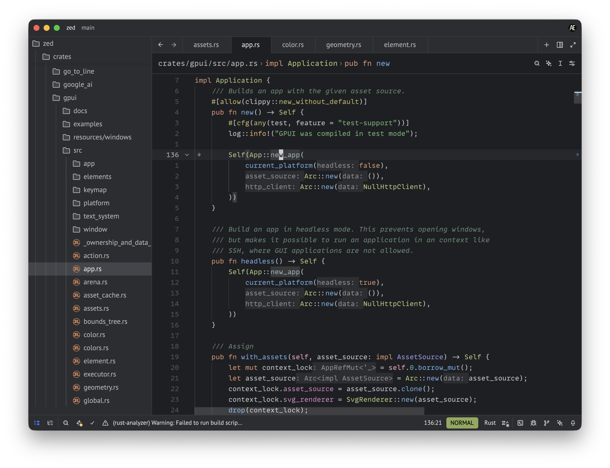
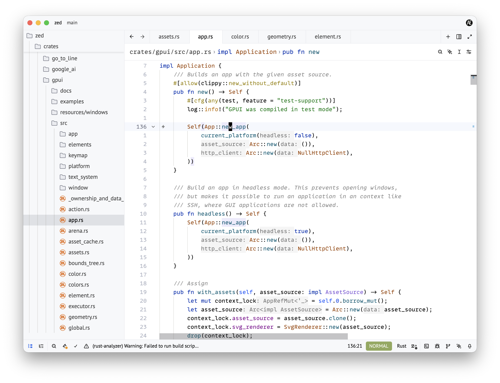

# JetBrains themes for Zed editor

Includes light and dark themes based on JetBrains IDE colors.

To install the theme in Zed, open the [extension page](https://zed.dev/extensions/jetbrains-themes) and click **Install in Zed**.

## JetBrains Dark

## JetBrains Light

